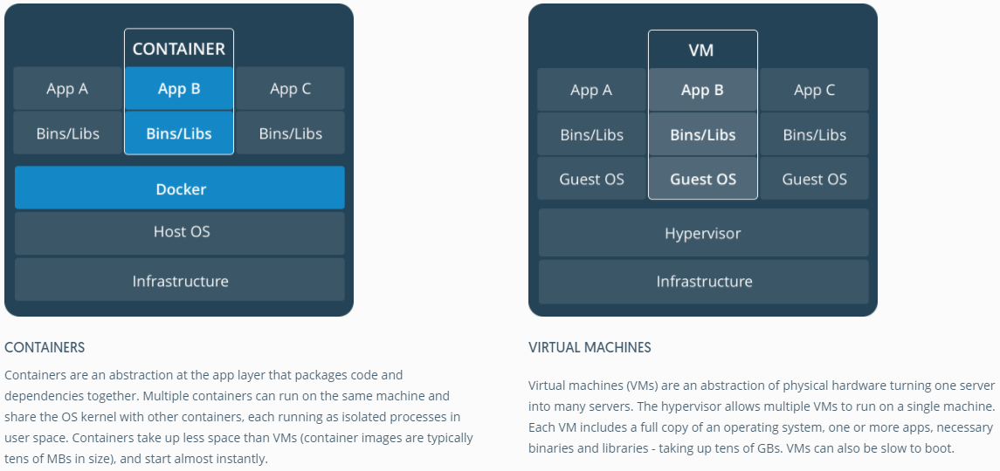

With the advent of virtualization we are shifting towards immutable deployments, containerization has certainly made the the realization of immutable deployments more concrete.

#### Immutable Deployments
In traditional deployments(traditional servers), we ssh into machines and make changes/update/patch even redploy on the same machine over time (thus `mutable Ifrastructure/deployments`). Keeping track of these mutations is difficult. Moreover its even harder to recreate the scenarios.

**Immutable** implies free of mutations. Thus in an **immutable infrastructure/deployment** if somethings needs be updated/reconfigured new servers are made and redeployed.

> Analogous to [pet vs cattle](http://cloudscaling.com/blog/cloud-computing/the-history-of-pets-vs-cattle/).

How does _Immutability_ help? Unlike mutable setups where configurations of same deployment can diverge due to undocumented changes, all deployments in an immutable setup are spawned from well versioned images(amis). All the servers behave the same way. This help realizing blue-green, rolling-updates to happen in no down time. Scaling has always been a hard problem, immutable infrastructure is definitely helps making our deployments elastic thus scalable.

#### Containerization
Encapsulating the application with its own requirements(configurations, files, ports etc.).

A **_Container_** is a process or group of processes with its own world consisting of a separate process tree, filesystem, network etc. A container is well isolated from its host machine and other containers.

> [Containarization != Virtualization](https://stackoverflow.com/questions/16047306/how-is-docker-different-from-a-virtual-machine)

Even though they feature some similar properties, they aren’t the same. Containers share the host operating system kernel unlike virtual machines which has their own kernel. Since containers are merely a process/group of processes, spawing containers is more faster than spawing a vm. Running and monitoring of containers with proper orchestrator(kubernetesetc.) is much more easier than monitoring a vm.

> Containers leads us to ➞ immutable deployments

We vendor images instead of jars/code etc. It surely makes the hard and longing process getting consistent environment quite easy. With containers we can dictate the resource limits for the application, running it in isolation from other processes in the machine. Due to its quick start capabilities, the elasticity(scale-up/scale-out) is much more higher.

#### Hints Suggesting Containerization
you are doing microservices
if your application doesn’t require the complete capacity of a vm but requires part of it.
you require robust CI/CD
want highly scalable, elastic deployments
